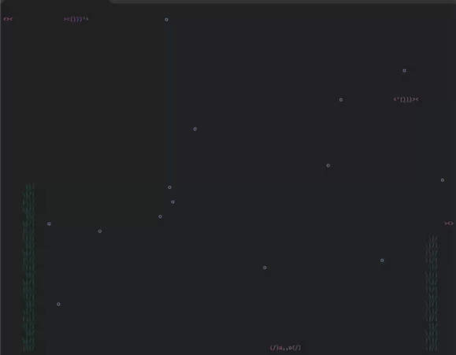

# AsciiAquarium in Go

A terminal-based ASCII aquarium animation written in Go.



## Features
- Live animation of fish, bubbles, and plants.
- Color support (Green plants, Blue bubbles, Random colored fish).
- Large fish sprites.
- Vertical fish movement.
- Dynamic plant generation.
- Moving crab at the bottom.
- Graceful exit with status 0 on Ctrl+C (when run as binary).

## How to Build and Run

Make sure you have Go installed.

### Option 1: Run directly using go run
```bash
go run main.go
```
*Note: Exiting with Ctrl+C might return an exit status of 1 because `go run` handles the signal.*

### Option 2: Build and run the binary (Recommended)
Building the binary ensures that the application returns an exit status of 0 when stopped with Ctrl+C.

```bash
go build
./asciiaquarium
```

To stop the animation, press `Ctrl+C`.
